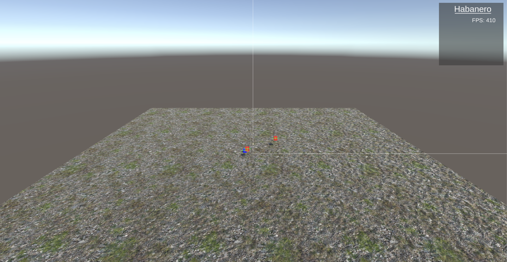
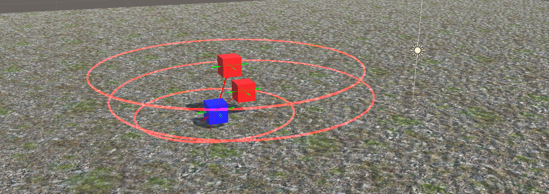
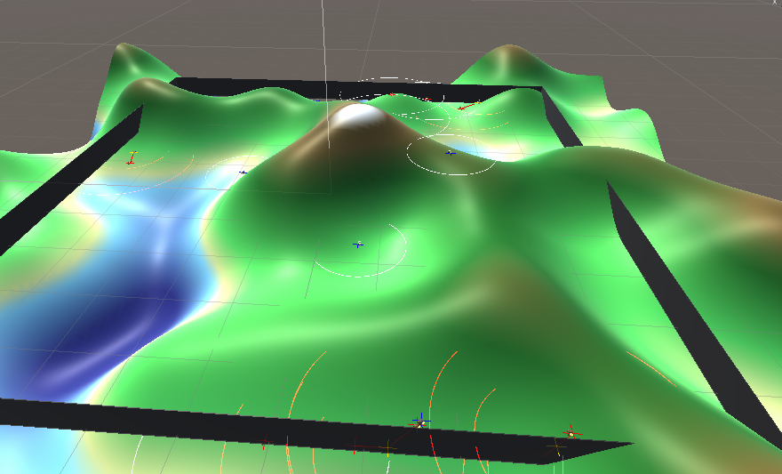

# Habanero

A procedurally generated environment where Quokka-looking agents named Colokai
(prey) will try to survive in a world of llama-looking Astabbas (predators).
The Astabbas, led by their leader, Esteban Julio Ricardo Montoya de la Rosa Ramírez,
will dominate the population of Colokai in the ever changing world of Habanero.

## TODO

- [x] Create base `Agent` class
- [x] Create prey & predator classes
- [x] Create environment class
- [x] Create Debug settings
- [x] Implement movement to agents
- [x] Implement tracking to agents
- [x] Implement genes to agents
- [x] Implement reproduction to agents
- [x] Implement "desire" to Agents based on state (thirsty, hungry, reproduce, etc)
- [x] Create procedurally generated terrain
- [ ] Create terrain classification (water spots, hills, food sources)
  - Partially completed
- [ ] Implement Agent detection to these locations
- [x] Implement dynamic, changing terrain
- [x] Model agents
- [x] Model food source

## Screenshots

